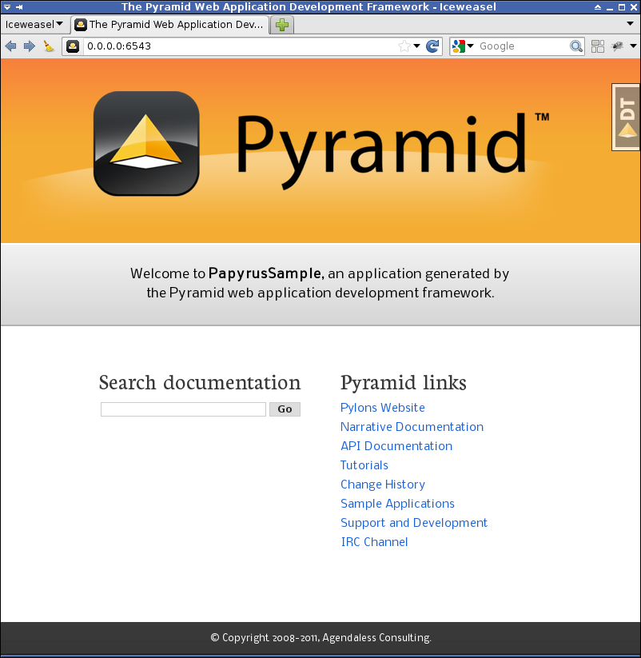

Création et découverte d'une application Pyramid
================================================

Création de l'application
-------------------------

Pour démarrer rapidement le développement d'une application Pyramid, le
framework offre 3 templates d'application appelés `scaffolds`.

Souvenez-vous, dans la section précédente, l'exécution de la commande
``pcreate --list`` nous a retourné la liste des 3 scaffolds que met Pyramid à
notre disposition:

  * ``alchemy``: un scaffold utilisant SQLAlchemy et le mécanisme "url dispatch"
    pour brancher les views sur des urls,

  * ``starter``: un scaffold minimaliste qui apporte le strict nécessaire mais ne
    fait pas de choix pour vous concernant l'utilisation de telle ou telle
    librairie,

  * ``zodb``: un scaffold utilisant la base de données objet ZODB et "traversal"
    pour la résolution des urls.

Pour ce workshop, nous allons utiliser le scaffold `alchemy` car nous
souhaitons utiliser l'excellente librairie SQLAlchemy/GeoAlchemy pour manipuler
la base de données depuis Python.
Nous allons donc créer une nouvelle application qu'on appellera `PapyrusSample`
à partir du scaffold `alchemy` en utilisant la commande suivante::

    (venv) $ pcreate -s alchemy PapyrusSample

Vous devez maintenant avoir un répertoire nommé ``PapyrusSample``. Ce répertoire
contient les fichiers de votre application, principalement des fichiers Python.

Cette dernière commande vous informe également qu'il faudra lancer le script
``populate_PapyrusSample`` après avoir installé l'application afin d'installer
la base de données. Notez le scaffold ``alchemy`` est configuré par défaut avec
la base de données SQLite (qui n'est pas celle utilisée dans ce workshop).

Test de l'application générée
-----------------------------

Maintenant il est temps de vérifier que votre application Pyramid fonctionne.
Pour cela allez dans le répertoire ``PapyrusSample`` et installez l'application
nouvellement créée dans votre virtualenv::

    (venv) $ cd PapyrusSample
    (venv) $ python setup.py develop

Cette dernière commande permet donc d'installer l'application PapyrusSample
ainsi que toutes ses dépendances.

Comme expliqué plus haut, nous pouvons maintenant lancer le script
``populate_PapyrusSample``::

    (venv) $ populate_PapyrusSample development.ini

Nous pouvons maintenant exécuter l'application dans un petit serveur web
fourni directement avec Pyramid::

    (venv) $ pserve development.ini 
    Starting server in PID 23035.
    serving on http://0.0.0.0:6543

Cette commande lance votre application dans le serveur web ``waitress`` qui est
le serveur web Python qu'on utilisera pendant le développement. On favorisera
l'utilisation d'un serveur web plus performant lors du déploiement de
l'application en production.

.. note::

    Vous pouvez utiliser ``pserve --reload development.ini`` afin que le
    serveur web ``waitress`` se relance de lui-même lorsque des fichiers sont
    modifiés dans votre application.

Ouvrez http://0.0.0.0:6543 dans votre navigateur web, vous devez voir la page
suivante:

Etude de l'application
----------------------

Voici l'arborescence de l'application générée avec le scaffold ``alchemy``::

    $ tree -F -n --dirsfirst PapyrusSample
    PapyrusSample
    ├── papyrussample/
    │   ├── scripts/
    │   │   ├── __init__.py
    │   │   ├── populate.py
    │   ├── static/
    │   │   └── ...
    │   ├── templates/
    │   │   └── mytemplate.pt
    │   ├── __init__.py
    │   ├── models.py
    │   ├── tests.py
    │   ├── views.py
    ├── PapyrusSample.egg-info/
    │   └── ...
    ├── CHANGES.txt
    ├── development.ini
    ├── MANIFEST.in
    ├── PapyrusSample.db
    ├── production.ini
    ├── README.txt
    ├── setup.cfg
    └── setup.py

Les sous-sections suivantes vous donnent un rapide tour d'horizon à travers les
répertoires et les fichiers de votre application Pyramid. Prenez le temps de
naviguer à travers ces répertoires et fichiers afin de bien comprendre comment
l'application est structurée.

Le répertoire principal de l'application, ``PapyrusSample``, contient:

``papyrussample``

    C'est le répertoire principal de l'application, son nom dépend du nom de
    l'application donné en argument de la commande ``pcreate``. C'est le module
    Python de l'application.

    ``templates``
        Le répertoire ``templates`` est l'endroit où sont stockés les templates
        utilisés pour faire le rendu html (ou autre) des views.

    ``static``
        Le répertoire ``static`` contient les fichiers statiques de
        l'application, i.e. HTML, CSS, JavaScript, images, etc.

    ``models.py``
        Le fichier ``models.py`` est l'endroit où est configuré le model
        de la base de données. C'est typiquement l'endroit où les tables et les
        relations sont définies avec SQLAlchemy.

    ``views.py``
        Le fichier ``views.py`` contient la logique de l'application..
        L'exécution d'une `views` est déclenchée par les requêtes HTTP qui
        atteignent l'application par une url donnée.
        Ils interagissent souvent avec le code des ``models`` et des
        ``templates``.

    ``tests.py``
        Le fichier ``tests.py`` est l'endroit où vous pouvez ajouter des tests
        Python automatisés pour l'application.

``development.ini`` et ``production.ini``
    Ce sont les fichiers de configuration de l'application pour le
    developpement ou pour la production. Ces fichiers inclus des paramètres
    comme l'adresse IP et le port TCP que le serveur doit écouter, la chaîne de
    connexion à la base de données, ainsi que tous les autres paramètres de
    configuration de votre application.

``setup.py``, ``setup.cfg`` et ``MANIFEST.in``
    Ces fichiers décrivent l'application (metadata, dépendances) et sont
    notamment utilisés lorsque que vous packagez votre application en vue de la
    publier.

``PapyrusSample.db``
    C'est la base de données SQLite qui a été générée lors de l'appel à la
    commande ``populate_PapyrusSample``.

Il faut savoir que cette structure n'est nullement figé, mais c'est la
structure qui est proposée dans le scaffold ``alchemy``.

Outils de debug
---------------

(debugtoolbar, pshell)

Résumé
------

